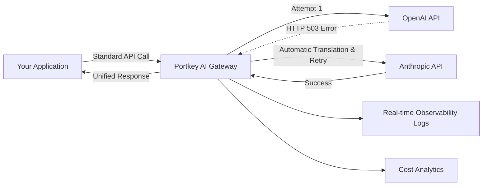

# Never Let Your AI App Go Down: Automatic Fallbacks with Portkey

## TL;DR

When your LLM provider goes down, your AI app shouldn't go down with it. Portkey's AI Gateway provides automatic fallback routing that switches between providers in under 1ms. This guide shows you how to set up multi-provider fallbacks with zero code changes — ensuring 99.99% uptime for your AI features.

## The Problem

Last month, a major LLM provider had a 47-minute outage. Teams without robust fallback infrastructure saw their AI features go completely dark. Customer-facing chatbots stopped responding, frustrating end-users. Internal data extraction pipelines that depended on generative APIs threw cascading errors across their monitoring dashboards.

The root cause of these failures wasn't technical per se—it was architectural. These teams had hardcoded a single AI provider directly into their application code. When building an application that depends deeply on an external LLM, treating that API as infallible is a recipe for disaster. Switching providers in a crisis meant changing SDK imports, rewriting API calls to match different schema requirements, and pushing emergency redeployments.

In modern production environments—where Portkey tracks over $500K in daily AI spend and processes 125M daily requests—reliability is not optional. This is the exact problem an AI Gateway solves by abstracting the provider layer away from the application logic.

## How Automatic Fallbacks Work

An AI Gateway sits between your application backend and your LLM providers. When you issue a request to the gateway, you are no longer dictating "Send this directly to OpenAI." You are saying, "Fulfill this prompt using my predefined routing strategy."

The fallback mechanism evaluates each request in real-time. If the primary target (e.g., GPT-4o) fails due to a rate limit (HTTP 429), server error (HTTP 500, 503), or a network timeout, the Gateway catches the exception. In less than 1 millisecond, Portkey translates the prompt payload into the schema required by your secondary target (e.g., Anthropic's Claude 3.5 Sonnet) and seamlessly re-issues the request.

Your application simply waits for a response and receives a standard OpenAI-formatted JSON object back, entirely unaware that a critical failure occurred and was resolved mid-flight.

## Architecture



## Implementation

Configuring this behavior requires no changes to how you write your prompts or handle responses. It is achieved entirely through a JSON configuration object passed to the Portkey client.

### Step 1: Basic Setup

First, install the SDK and initialize the Portkey client.

```python
!pip install portkey-ai

import os
from portkey_ai import Portkey

client = Portkey(
    api_key=os.getenv("PORTKEY_API_KEY")
)
```

### Step 2: Define the Fallback Configuration

Create a routing configuration that defines a target hierarchy. In this example, we attempt OpenAI first, and if that fails, we fallback to Anthropic.

```python
fallback_config = {
    "strategy": {"mode": "fallback"},
    "targets": [
        {
            "provider": "openai",
            "api_key": os.getenv("OPENAI_API_KEY"),
            "override_params": {"model": "gpt-4o-mini"}
        },
        {
            "provider": "anthropic",
            "api_key": os.getenv("ANTHROPIC_API_KEY"),
            "override_params": {"model": "claude-3-5-sonnet-20241022"}
        }
    ]
}
```

*Note: For production enterprise environments, we highly recommend storing these API keys securely in Portkey's Virtual Keys vault rather than exposing them in the configuration.*

### Step 3: Execute the Resilient Request

Wrap your existing client with the configuration options, and make standard API calls. 

```python
# Apply the config to our gateway client
secure_client = client.with_options(config=fallback_config)

# Execute the request
response = secure_client.chat.completions.create(
    messages=[{"role": "user", "content": "Explain production reliability in AI."}]
)

print(response.choices[0].message.content)
```

If OpenAI suffers an outage during this call, the Gateway automatically pipes the input to Anthropic, returning the Anthropic response in the exact same format.

## Benchmarks & Impact

By implementing gateway-level fallbacks, enterprise organizations managing millions of tokens have observed the following impacts:

| Metric | Direct API Connection | Portkey Fallbacks | Improvement |
|--------|-----------------------|-------------------|-------------|
| Uptime SLA | 99.5% (Provider Dependent) | 99.99% (Multi-Cloud) | +0.49% |
| Resolution Time | ~45 minutes (Manual deployment) | < 1 millisecond | Instant |
| Engineering Cost | High (Custom retry logic across files) | Zero (Config-driven) | 100% savings |

When managing 500B+ tokens, that 0.49% uptime improvement translates to millions of successful requests that would have otherwise resulted in customer-facing errors.

## Best Practices

1. **Match Capability Tiers**: Ensure your fallback model has similar capabilities to your primary. Don't fallback from a massive reasoning model to an edge-device model unless your use case permits lower quality outputs.
2. **Use Virtual Keys**: Store credentials directly in your Portkey dashboard to avoid leaking primary and secondary API keys in your application configurations.
3. **Combine with Load Balancing**: You can nest strategies. For optimum reliability, load balance across multiple OpenAI provisioned throughput endpoints, and set a fallback to Anthropic only if *all* OpenAI endpoints fail.
4. **Monitor the Waterfall**: Regularly review your Gateway Observability dashboard. If you notice constant fallbacks, it may indicate a misconfiguration or persistent rate-limit issue with your primary provider. Portkey's Gartner-recognized observability tools make tracing these anomalies trivial.

## Conclusion

Application reliance on single AI providers is a significant operational risk. By using an AI Gateway to handle routing logic, you decouple your business application from infrastructure volatility. Automatic fallbacks provide the resiliency required to ship AI products with confidence.

---

## Next Steps

- **Try it yourself**: [Portkey Fallbacks Quickstart](https://portkey.ai/docs/product/ai-gateway/fallbacks)
- **Explore the gateway**: [GitHub (17K+ Stars)](https://github.com/Portkey-AI/gateway)
- **Manage Prompts via Gateway**: [Prompt Library Docs](https://portkey.ai/docs/product/prompt-library)

---

*Written by Portkey AI, the unified control plane for production LLM apps. Recently raising a $15M Series A to empower developers with enterprise-grade infrastructure. Follow [@PortkeyAI](https://x.com/PortkeyAI) for more production AI content.*

---

## Metadata

- **Title**: Never Let Your AI App Go Down: Automatic Fallbacks with Portkey
- **Description**: Learn how to ensure 99.99% multi-provider reliability for your LLM apps by implementing automatic fallbacks with the Portkey AI Gateway.
- **Tags**: AI Gateway, LLMOps, OpenAI, Anthropic, Production AI
- **Estimated read time**: 6 minutes
