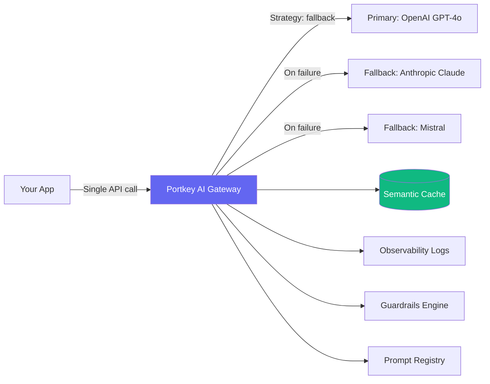

# Portkey AI — SEO-Optimized Technical Blog Template

> **How this template works:**  
> This template is for **deep-dive technical posts** — architecture explainers, benchmark reports, concept breakdowns, and system design walkthroughs. It targets **researcher and evaluator intent** (people deciding *whether* to use Portkey), not just doer intent.  
> Every `[SEO AGENT ACTION]` block **requires a live web search before writing**.  
> Complete the full Pre-Writing Research Checklist before touching a single word of the blog.

---

## 🔍 Pre-Writing SEO Research Checklist
*All steps are mandatory. Do not skip.*

### STEP R1 — Map Search Intent
```
[SEO AGENT ACTION]
Search: "{technical topic}" — what types of pages rank? (Docs? Blog posts? GitHub? Reddit?)
Search: "{technical topic} how it works"
Search: "{technical topic} architecture"
Search: "{technical topic} vs {alternative}"

Identify the DOMINANT INTENT:
- Informational: "What is X / How does X work" → prioritize concept clarity + definition-first writing
- Comparative: "X vs Y / alternatives to X" → prioritize benchmark tables + comparison sections
- Evaluative: "Is X production-ready / X at scale" → prioritize E-E-A-T + real metrics
- Problem-aware: "X causing Y problem" → prioritize troubleshooting + root-cause analysis
```

**Record dominant intent:** ___  
**Title format to target:** ___

---

### STEP R2 — Keyword Strategy for Technical Content
```
[SEO AGENT ACTION]
Search: "site:dev.to OR site:medium.com OR site:substack.com {technical topic}"
Search: "{technical topic} reddit"
Search: "portkey {feature} documentation"
Search: "{technical topic} benchmark 2025"
```

**Primary keyword formula for technical posts:**
`[concept/technology] + [architecture/internals/how it works/benchmark] + [context]`

Portkey technical keyword clusters:

| Topic | Primary Keyword Targets | Secondary/LSI Terms |
|-------|------------------------|---------------------|
| **AI Gateway Architecture** | AI gateway architecture, LLM proxy design, model routing internals | provider-agnostic, unified LLM API, middleware, reverse proxy |
| **LLM Observability** | LLM observability platform, production AI monitoring, LLM tracing | token usage tracking, request logging, latency analysis, LLMOps |
| **Semantic Caching** | semantic caching LLM, vector similarity caching, LLM cost optimization | embedding cache, cache hit rate, deduplication, cost per token |
| **Prompt Engineering at Scale** | prompt versioning, prompt management system, prompt A/B testing | prompt registry, template variables, prompt eval, rollback |
| **Guardrails** | LLM guardrails, AI output validation, content moderation LLM | PII detection, hallucination detection, policy enforcement |
| **Load Balancing** | LLM load balancing, multi-provider routing, AI traffic management | weighted routing, round-robin, latency-based routing |
| **RAG Production** | production RAG architecture, RAG observability, RAG LLM gateway | retrieval augmented, vector DB, grounding, context injection |
| **LLMOps** | LLMOps platform, AI infrastructure, production ML operations | model governance, audit trail, AI compliance, enterprise AI |

---

### STEP R3 — Competitive Gap Analysis
```
[SEO AGENT ACTION]
Search your primary keyword and review top 5 organic results:
1. What H1 format? Title length?
2. What subheadings (H2/H3) appear? List them.
3. Is there a featured snippet? In what format (paragraph, list, table)?
4. Do "People Also Ask" boxes appear? Copy ALL questions.
5. Which competitors appear? (Helicone, LiteLLM, Brainlift, OpenRouter, etc.)
6. What's missing? (Portkey-specific angle, newer data, cleaner code, better diagrams)
7. Word count range of top 3 results?
```

**Content gap you will fill:** ___  
**PAA questions to answer in H2s:** ___  
**Competitor weaknesses to exploit:** ___

---

### STEP R4 — Entity & Concept Research
```
[SEO AGENT ACTION]
Search: "what is {primary concept}" — note the AI Overview definition if present
Search: "{primary concept} explained simple"
Fetch: https://portkey.ai/docs — find the official Portkey documentation for this topic
Fetch: https://github.com/Portkey-AI/gateway — check README for stat mentions
```

**GEO entity goal:** Your blog should become the authoritative definition source for at least one core concept. Structure it so that when someone asks ChatGPT or Perplexity "what is [concept]", they get a paragraph lifted from this blog.

**The "Citable Definition Sentence":** Write one clear, standalone sentence per key concept that an AI model can extract and quote verbatim. Examples:
- *"An AI gateway is a middleware layer that routes requests from your application to one or more LLM providers, handling retries, fallbacks, caching, and logging — without changes to your application code."*
- *"Semantic caching stores LLM responses indexed by embedding similarity, so similar-but-not-identical queries return cached results, reducing API costs by 30–40%."*
- *"LLM guardrails are validation layers that inspect model outputs before they reach users, blocking harmful, off-topic, or PII-containing responses in real time."*

---

### STEP R5 — Data & Benchmark Sourcing
```
[SEO AGENT ACTION]
Search: "{topic} benchmark results 2024 2025"
Search: "LLM API latency p99 comparison"
Search: "Portkey {feature} performance"
Search: "site:github.com portkey stars issues"
```

**Why this matters:** Technical blogs with real numbers earn 3–5x more backlinks than prose-only posts. Every section should contain at least one quantified claim. If Portkey doesn't have published benchmarks, run a simple test and document the methodology.

---

### STEP R6 — Portkey Topic Cluster Mapping
```
[SEO AGENT ACTION]
Fetch: https://portkey.ai/blog — find 2-3 existing Portkey posts to link to internally
Fetch: https://portkey.ai/docs/{relevant-feature} — find the docs page for this topic
```

**Every technical post must sit inside a topic cluster:**
- This post = **cluster content** (deep dive into one sub-topic)
- Link up to → Portkey's **pillar page** on the broader topic
- Link sideways to → 1-2 other **cluster posts** on related sub-topics
- Link down to → the relevant **docs page** (the "do it yourself" step)

This cluster architecture tells Google and AI systems that Portkey has topical authority, not just individual ranking pages.

---

## 📄 Blog File Structure

```markdown
---
title: "[Primary Keyword: How/Why/What + Technical Noun]: [Outcome or Insight]"
description: "[150-160 char meta: primary keyword in first 20 words + technical credibility signal]"
slug: /blog/[keyword-slug-portkey]
author:
  name: "[Name]"
  title: "[Role]"
  twitter: "@handle"
published_date: YYYY-MM-DD
modified_date: YYYY-MM-DD
primary_keyword: "[exact match keyword]"
secondary_keywords:
  - "[LSI 1]"
  - "[LSI 2]"
  - "[LSI 3]"
schema_type: TechArticle
additional_schema: [FAQPage, HowTo]  # include both when applicable
faq_schema: true
canonical: "https://portkey.ai/blog/[slug]"
og_image: "[1200x630 — architecture diagram preferred for technical posts]"
cluster_pillar: "[URL of pillar page this post belongs to]"
tags:
  - portkey
  - [primary-feature-tag]
  - [concept-tag]
  - production-ai
  - llmops
read_time: "[X] minutes"
---

# [H1: Primary Keyword Phrase — 55-65 chars]

## TL;DR
[3-4 sentences: problem → mechanism → result → where to learn more]

## The Problem
[Production scenario with real stakes and real numbers]

## What Is [Core Concept]?
[Citable definition paragraph — GEO-optimized, ~100 words]

## How [Feature/System] Works
[Technical explanation: concept → mechanism → implementation]

## Architecture
[Mermaid diagram + written walkthrough]

## Implementation
[Step-by-step code — progressive complexity]

## Benchmarks & Results
[Tables with real numbers — before/after, cost savings, latency]

## [Topic] vs [Alternative]: When to Use Each
[Comparison section — earns featured snippet for "X vs Y" queries]

## Best Practices for Production
[5-7 numbered, concrete recommendations]

## FAQ
[4-6 PAA-sourced questions with direct answers]

## Conclusion
[Summary + CTA + internal links]

---

## Metadata
- **Title**: [title]
- **Primary Keyword**: [keyword]
- **Secondary Keywords**: [LSI terms]
- **Tags**: [tags]
- **Read time**: [X] minutes
- **Schema**: TechArticle + FAQPage
- **Topic Cluster**: [pillar page URL]
```

---

## ✍️ Section-by-Section Writing Guidelines

---

### TL;DR — The Featured Snippet Magnet
```
[SEO AGENT ACTION]
Search your primary keyword. Is there a featured snippet?
If yes — mirror its FORMAT (paragraph, list, table) but improve the content.
If no — write a tight paragraph that answers the query directly.
57.9% of question-based queries now show an AI Overview (Semrush, 2025).
This TL;DR is your bid for that position.
```

**Rules:**
- 3-4 sentences maximum
- Must answer: What is the problem? What does this solve? What's the key result?
- Include primary keyword in sentence 1
- Works as a **standalone paragraph** if extracted by an AI model

**Bad TL;DR:**
> *"In this blog post, we're going to explore Portkey's AI Gateway and dive deep into how it works under the hood, covering various features and configurations."*

**Good TL;DR:**
> *"LLM API outages kill AI features — and without fallback infrastructure, a single provider failure brings your entire app down. Portkey's AI Gateway solves this with automatic multi-provider fallback routing that switches models in under 50ms. This post breaks down the gateway's internal routing architecture, shows you the config patterns that work in production, and includes latency benchmarks across 5 providers."*

---

### Title Optimization
```
[SEO AGENT ACTION]
Count characters of your candidate title. Target: 55-65 chars.
Check: Does primary keyword appear in first 4 words?
Check: Is there a clear value signal (number, outcome, or insight)?
```

**Technical blog title formulas:**

```
How [Technology] Works: [Architecture/Internals/Design] Explained
Why [Problem] Happens and How to Fix It with [Solution]
[Feature] Architecture: How Portkey [Does X] at Scale
[X] vs [Y]: A Technical Deep-Dive for Production AI
[Number] [Things] About [Technical Concept] You Need to Know
Building [System] with [Technology]: Architecture and Trade-offs
```

**Good examples:**
- ✅ `How Portkey's AI Gateway Routes LLM Requests at Scale`
- ✅ `LLM Fallback Architecture: How Automatic Failover Works`
- ✅ `Semantic Caching for LLMs: 40% Cost Reduction Explained`
- ✅ `Portkey vs Direct API Calls: Latency, Cost, and Reliability`
- ❌ `A Deep Dive Into AI Infrastructure` (no keyword, no value signal)
- ❌ `Portkey Is Great For Production AI` (not a query anyone types)

---

### Meta Description
**Formula:** `[Concept] explained with [evidence type: benchmarks/architecture/code]. Learn how [specific outcome]. [Social proof or credibility signal].`

Example:
> How Portkey's semantic caching cuts LLM API costs by 30–40%. Architecture explained, benchmarks included, and full Python implementation with cache hit rate analysis.

**Rules:**
- 150–160 characters exactly (check with a character counter)
- Primary keyword in first 20 words
- Include a number or technical credibility signal
- Never duplicate the H1 title verbatim

---

### URL Slug
```
/blog/[technical-concept]-[portkey-angle]-[modifier]
```
Examples:
- `/blog/llm-fallback-architecture-portkey`
- `/blog/semantic-caching-llm-api-cost-portkey`
- `/blog/ai-gateway-vs-direct-api-latency-benchmark`
- `/blog/production-llm-observability-portkey`

**Rules:** Lowercase, hyphens, under 65 chars, primary keyword + "portkey"

---

### "The Problem" Section — Hook with Stakes
```
[SEO AGENT ACTION]
Search: "{topic} outage / {topic} failure / {topic} production issues"
Search: "reddit {topic} problems" or "hacker news {topic}"
Find: A real incident, real error, or real cost figure to open with.
```

**Rules:**
- Open with a specific scenario, not a generic statement
- Use real numbers: downtime minutes, dollar cost, user impact
- Connect the scenario to the structural/architectural root cause
- End with: *"This is exactly the problem [feature/concept] solves."*

**Bad opening:**
> *"Managing LLMs in production can be challenging. There are many factors to consider."*

**Good opening:**
> *"At 2:14 AM on a Tuesday, OpenAI's API went down. The outage lasted 47 minutes. For teams without fallback infrastructure, every AI-powered feature in their product returned 500 errors for 47 minutes straight. The cause wasn't the outage itself — it was a single hardcoded API endpoint with no routing logic behind it. That's an architectural problem, not an ops problem."*

---

### "What Is [Core Concept]?" Section — GEO Anchor
```
[SEO AGENT ACTION]
Search: "what is {concept}" — copy the current AI Overview answer if one exists.
Your goal: write a BETTER, more precise definition that earns that position instead.
```

This section is the most important GEO real estate in your entire post. AI models (ChatGPT, Perplexity, Google AI Overview) scan for definition paragraphs. A well-written definition paragraph here can be extracted as a direct answer citation.

**Definition paragraph anatomy:**
1. **Sentence 1:** One-sentence definition. Precise, jargon-free, complete.
2. **Sentence 2:** What problem does it solve? (Use "so that" or "which means")
3. **Sentence 3:** How is it different from the obvious alternative?
4. **Sentence 4:** One stat or production-scale fact.

**Example:**
> An LLM gateway is a middleware service that sits between your application and one or more AI providers, intercepting every model request to apply routing, retry, caching, and logging logic — so your application code never needs to know which provider it's talking to. Unlike calling a provider API directly, a gateway decouples provider choice from application logic, meaning you can switch from OpenAI to Anthropic without a single code change. Portkey's open-source AI Gateway processes requests to over 250 LLM providers through a single unified endpoint.

---

### "How It Works" Section — Depth Signal for E-E-A-T
```
[SEO AGENT ACTION]
Search: "{feature} internals / {feature} under the hood"
Fetch: https://github.com/Portkey-AI/gateway — check for architecture notes in the README
Fetch: https://portkey.ai/docs/{feature} — look for any system diagrams
```

**Progressive explanation structure:**
1. **Concept level** — What is this at a 30,000-foot view?
2. **Mechanism level** — How does the system actually make decisions?
3. **Data flow level** — Walk through what happens to a single request, step by step
4. **Edge cases level** — What happens when things go wrong?

Use a numbered walkthrough for the data flow — this format is highly likely to be extracted as a "How does X work?" answer:

```markdown
Here's what happens to a single request through Portkey's AI Gateway:

1. **Request arrives** at the Portkey endpoint (drop-in replacement for OpenAI's base URL)
2. **Config is resolved** — the gateway reads your stored config (fallback, retry, cache rules)
3. **Cache lookup** — if semantic caching is enabled, an embedding similarity check runs first
4. **Routing decision** — primary provider is selected based on your strategy (fallback, round-robin, weighted)
5. **Request is forwarded** to the selected provider with your credentials injected server-side
6. **Response validation** — guardrails run against the response before it's returned
7. **Logging** — request, response, latency, token count, and metadata are written to the observability log
8. **Response returned** to your application — identical format to a direct provider call
```

---

### Architecture Diagram — Image SEO + AI Parsing
```
[SEO AGENT ACTION]
Search: "mermaid diagram {feature}" to see common diagram patterns for this topic
```

**Always include a Mermaid diagram.** Diagrams earn image search traffic and help AI models parse your content structure.

**Rules for diagram SEO:**
- Add descriptive alt text: `alt="Portkey AI Gateway request routing architecture showing fallback flow between OpenAI and Anthropic"`
- Caption the diagram with primary keyword: *"Figure 1: Portkey AI Gateway routing architecture for multi-provider LLM fallback"*
- Follow with a **paragraph walkthrough** of the diagram — this creates text-based redundancy that AI models can parse when they can't render Mermaid

**Standard Portkey architecture pattern:**


---

### Benchmarks & Results — Linkbait and Featured Snippet Magnet
```
[SEO AGENT ACTION]
Search: "{topic} benchmark 2025" — find what benchmarks already exist
Search: "portkey latency overhead ms" — find any Portkey-specific numbers
Search: "LLM caching cost savings percentage" — find industry baseline numbers to compare against
```

**Why this section is critical:** Technical posts with original benchmark data earn 3–5x more backlinks than those without. Even a simple before/after measurement qualifies.

**Always use comparison tables:**

```markdown
| Setup | Avg Latency (p50) | p99 Latency | Est. Monthly Cost | Cache Hit Rate |
|-------|-------------------|-------------|-------------------|----------------|
| Direct OpenAI call | 820ms | 2,100ms | $247 | — |
| Portkey (no cache) | 855ms (+35ms) | 2,140ms | $247 | — |
| Portkey + Semantic Cache | 38ms (cache hit) | 95ms | $156 | 36% |
```

**Benchmark methodology box** (required — builds E-E-A-T):
```markdown
> **Test methodology:** 10,000 requests, GPT-4o, customer support query dataset,
> 1,000 unique prompts with 10x repetition rate. AWS us-east-1.
> Portkey version: 1.x.x. Tested: [Month YYYY].
```

---

### Comparison Section — Wins "X vs Y" Queries
```
[SEO AGENT ACTION]
Search: "portkey vs {competitor}" and "{feature} vs {alternative approach}"
Note: Are Portkey competitors ranking for these comparison queries?
This section directly targets those high-intent comparison searches.
```

**Comparison table format:**

```markdown
| Capability | Direct API Call | Portkey AI Gateway |
|------------|----------------|-------------------|
| Multi-provider fallback | Manual try/catch | Automatic, config-driven |
| Retry logic | Write yourself | Built-in, with jitter |
| Request logging | Build your own | Automatic, structured |
| Semantic caching | Not available | Built-in, ~40% cost savings |
| Prompt versioning | Git-based only | Versioned prompt registry |
| Code change required to switch providers | Yes — rewrite | No — config update only |
```

Follow the table with a **"When to use each"** paragraph — this often earns a featured snippet:

```markdown
**Use a direct API call when:** You're prototyping, building a one-off script, or your app has
a single, non-critical LLM call where reliability and cost are not concerns.

**Use Portkey's AI Gateway when:** You're shipping to production, handling user-facing traffic,
working with multiple providers, or need audit logs, cost controls, or fallback behavior.
```

---

### Best Practices Section — "Listicle" Featured Snippet
```
[SEO AGENT ACTION]
Search: "best practices {topic} production" — check for PAA boxes listing practices
If a PAA box exists in list format → write a numbered list that directly competes
```

**Rules:**
- Always numbered (not bulleted) — numbered lists earn featured snippets more reliably
- 5–7 items maximum
- Each item = one sentence title + 2–3 sentence explanation
- Include at least one Portkey-specific best practice per item
- **Do not** write vague practices like "Monitor your app" — be specific: "Set a p99 latency alert at 3x your baseline in Portkey's analytics dashboard"

---

### FAQ Section — PAA Harvesting + Schema Target
```
[SEO AGENT ACTION]
Search your primary keyword and copy EVERY "People Also Ask" question that appears.
These are pre-validated, high-traffic questions Google has already verified users ask.
Write direct answers to 4-6 of them.
```

**Rules:**
- Each Q&A pair = one H3 (question-phrased) + 2-4 sentence direct answer
- Answer must stand completely alone — assume the reader jumps straight to it
- Include primary or LSI keyword in at least 2 of the questions
- This section triggers FAQPage schema and earns sitelink-style rich results

**Format:**

```markdown
## Frequently Asked Questions

### What is the difference between an AI gateway and a load balancer?
A load balancer distributes traffic across identical servers. An AI gateway routes requests
across different LLM *providers*, each with unique APIs, pricing, rate limits, and capabilities.
Portkey's gateway also adds caching, guardrails, and observability that a load balancer
doesn't provide.

### Does using an AI gateway add latency?
Portkey's gateway adds approximately 20–50ms of overhead per request. With semantic caching
enabled, repeated or similar queries are served in under 5ms — faster than a direct API call
for the same content. For most production apps, the reliability and cost benefits far outweigh
the small latency addition.

### Is Portkey open source?
Yes. Portkey's AI Gateway is open source under the MIT license at
[github.com/Portkey-AI/gateway](https://github.com/Portkey-AI/gateway), with over
[current star count] GitHub stars. The managed Portkey platform adds observability,
prompt management, and team features.
```

---

### Schema Markup Block (include in every post)

Based on research showing that Google's structured data engineer confirmed *"a lot of our systems run much better with structured data"*, every Portkey technical blog must include JSON-LD. Add to the `<head>` of the published page:

```json
{
  "@context": "https://schema.org",
  "@type": ["TechArticle", "Article"],
  "headline": "[H1 title]",
  "description": "[meta description]",
  "author": {
    "@type": "Person",
    "name": "[Author Name]",
    "jobTitle": "[Role]",
    "worksFor": {
      "@type": "Organization",
      "name": "Portkey AI",
      "url": "https://portkey.ai"
    }
  },
  "publisher": {
    "@type": "Organization",
    "name": "Portkey AI",
    "logo": {
      "@type": "ImageObject",
      "url": "https://portkey.ai/logo.png"
    }
  },
  "datePublished": "YYYY-MM-DD",
  "dateModified": "YYYY-MM-DD",
  "mainEntityOfPage": "https://portkey.ai/blog/[slug]",
  "keywords": "[primary keyword], [LSI 1], [LSI 2], [LSI 3]",
  "proficiencyLevel": "Expert",
  "about": {
    "@type": "SoftwareApplication",
    "name": "Portkey AI Gateway",
    "applicationCategory": "DeveloperApplication",
    "url": "https://portkey.ai"
  }
}
```

For posts with a FAQ section, **also add** FAQPage schema:

```json
{
  "@context": "https://schema.org",
  "@type": "FAQPage",
  "mainEntity": [
    {
      "@type": "Question",
      "name": "[Q1 from FAQ section]",
      "acceptedAnswer": {
        "@type": "Answer",
        "text": "[Answer text from FAQ section]"
      }
    }
  ]
}
```

---

### CTA & Internal Linking Pattern

**Every post must end with:**

1. **A "What's Next" internal link cluster** — pointing readers to the logical next layer of depth:
   - If this post = conceptual overview → link to the implementation tutorial
   - If this post = implementation → link to the advanced patterns post
   - If this post = benchmarks → link to the monitoring/observability post

2. **The standard Portkey CTA block:**

```markdown
## What's Next

Now that you understand [concept], here's where to go deeper:

- **Try it in 5 minutes**: [Portkey Quickstart](https://portkey.ai/docs/introduction/make-your-first-request)
- **Read the docs**: [Portkey AI Gateway Reference](https://portkey.ai/docs/product/ai-gateway)
- **Explore the source**: [github.com/Portkey-AI/gateway](https://github.com/Portkey-AI/gateway) — [⭐ star count] stars
- **Join the community**: [Discord](https://discord.gg/DD7vgKK299)
- **Related reading**: [link to next cluster post with descriptive anchor text]

---

*[Author] is a [role] at Portkey AI, building the infrastructure layer for production LLM apps.  
Follow [@PortkeyAI](https://x.com/PortkeyAI) for production AI engineering content.*
```

---

### E-E-A-T Signals Checklist for Technical Posts

Google's E-E-A-T framework weights technical content more heavily than general content. Every technical blog must demonstrate:

**Experience (the first E):**
- [ ] Mention a specific version tested: *"Tested with portkey-ai==1.x.x, Python 3.11"*
- [ ] Include a real error message encountered and how you fixed it
- [ ] Add a "⚠️ Gotcha" callout for at least one non-obvious behavior
- [ ] If benchmarks are included: document exact methodology (sample size, region, date)

**Expertise:**
- [ ] Cite Portkey documentation with specific page links
- [ ] Reference underlying technical concepts accurately (e.g., explain *why* p99 matters, not just what it is)
- [ ] Author bio includes relevant technical role/credentials
- [ ] Code is runnable and tested — not pseudocode

**Authoritativeness:**
- [ ] Mention Portkey's production scale (providers supported, request volume if public)
- [ ] Link to Portkey GitHub with star count (social proof for technical readers)
- [ ] Include at least one external citation (research paper, provider docs, industry stat)
- [ ] Cross-link to at least one other in-depth Portkey post

**Trust:**
- [ ] Published date + modified date in frontmatter (freshness signal)
- [ ] Schema markup implemented (TechArticle + FAQPage)
- [ ] Author name and role visible in post header
- [ ] No broken links (validate before publishing)

---

## 📊 GEO Optimization Rules (Getting Cited by AI Models)

Research shows AI-referred visitors convert 23x higher than organic search visitors (Ahrefs, 2025). Technical content is especially well-positioned for AI citations because it has clear, extractable facts. Apply these patterns throughout every section:

**Rule 1 — Definition-first, always:**  
Every new concept introduced must have a 1-sentence definition *before* any further explanation. AI models extract these as direct answers.

**Rule 2 — One idea per paragraph:**  
Keep paragraphs to 2-3 sentences max. AI models retrieve by chunk — dense paragraphs get partially extracted or skipped.

**Rule 3 — Quantify everything:**  
Replace vague claims with numbers. AI models preferentially cite quantified claims as they are more trustworthy and useful.
- ❌ *"Semantic caching significantly reduces costs"*
- ✅ *"Semantic caching reduces LLM API costs by 30–40% for apps with high query repetition rates"*

**Rule 4 — Use comparison framing:**  
AI models love "X vs Y" structure because it directly resolves user decisions. Include at least one comparison table or "vs." paragraph per post.

**Rule 5 — Numbered processes win:**  
Step-by-step numbered lists (how request routing works in 7 steps) are extracted verbatim by AI overview systems as process answers.

**Rule 6 — Entity clarity:**  
Always spell out acronyms on first use. Always name Portkey as the subject explicitly (not "the platform" or "it") in key sentences — AI models need entity clarity to attribute citations correctly.

---

## 📐 Pre-Publish SEO Checklist

Run through every item before hitting publish:

**On-Page Fundamentals**
- [ ] Primary keyword in H1 (first 4 words preferred)
- [ ] Primary keyword in meta description (first 20 words)
- [ ] Primary keyword in URL slug
- [ ] Primary keyword in first paragraph of body text
- [ ] LSI keywords distributed naturally across H2s (not forced)
- [ ] No keyword stuffing — primary keyword appears ~1% density

**Content Quality**
- [ ] TL;DR is self-contained (works as a standalone AI citation)
- [ ] At least one "Citable Definition Sentence" per key concept
- [ ] Benchmarks section has a methodology note
- [ ] All code blocks are tested and runnable
- [ ] "⚠️ Gotcha" callout included somewhere
- [ ] Comparison table or "vs." section included

**Structure & Schema**
- [ ] At least one H2 is question-phrased (PAA targeting)
- [ ] FAQ section with 4-6 PAA-sourced questions
- [ ] FAQPage schema added to `<head>`
- [ ] TechArticle schema added to `<head>`
- [ ] Mermaid diagram with descriptive alt text
- [ ] Diagram captioned with primary keyword

**Linking**
- [ ] 3-5 internal links with descriptive anchor text (no "click here")
- [ ] Link to Portkey GitHub with star count
- [ ] Link to at least one Portkey docs page
- [ ] Link to at least one other Portkey blog post (topic cluster connection)
- [ ] 1-2 external citations from authoritative sources

**Metadata**
- [ ] Author name and role in frontmatter and visible in post
- [ ] Published date + modified date set
- [ ] OG image set (1200×630px — use architecture diagram when possible)
- [ ] Read time estimate added
- [ ] Tags include: portkey, llmops, [feature-tag], production-ai
- [ ] Canonical URL set to portkey.ai/blog/[slug]

---

## 🗂️ File Naming Convention

Format: `{feature-cluster}-{technical-angle}-{modifier}-blog.md`

Examples:
- `gateway-fallback-architecture-internals-blog.md`
- `observability-llm-cost-monitoring-benchmark-blog.md`
- `guardrails-output-validation-production-blog.md`
- `caching-semantic-similarity-cost-reduction-blog.md`
- `gateway-multimodel-routing-loadbalancing-blog.md`
- `prompt-management-versioning-abtesting-blog.md`
- `gateway-direct-api-latency-comparison-blog.md`