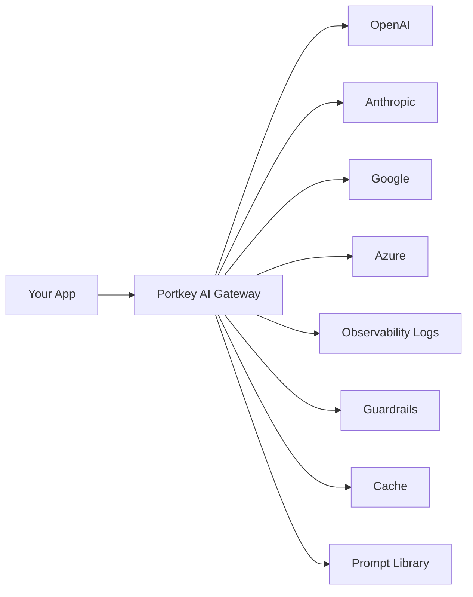

# Technical Blog Template

Use this structure when generating deep-dive technical blog posts for Portkey AI.

---

## File Structure

```markdown
# [Title]

## TL;DR

[3-4 sentence summary of the problem and solution]

## The Problem

[Why this matters for production AI teams — 2-3 paragraphs]

## How [Feature/Concept] Works

[Technical explanation with architecture diagrams — 3-5 paragraphs]

## Architecture

[Mermaid diagram or described diagram]

## Implementation

[Step-by-step code walkthrough — the bulk of the article]

## Benchmarks / Results

[Performance data, cost comparisons, before/after metrics]

## Best Practices

[Production-ready patterns and recommendations]

## Conclusion

[Summary + next steps + CTA]

---

## Metadata

- **Title**: [SEO-optimized title]
- **Description**: [150 chars for meta description]
- **Tags**: [3-5 relevant tags]
- **Estimated read time**: [X] minutes
```

---

## Section Guidelines

### TL;DR
- 3-4 sentences max
- State the problem, solution, and key result
- Should work as a standalone summary

### The Problem
- Start with a relatable production scenario
- Use specific numbers where possible (downtime minutes, cost dollars)
- Connect to broader industry challenges

### How It Works
- Progressive explanation: concept → mechanism → implementation
- Use analogies for complex infrastructure concepts
- Include architecture diagrams (mermaid or described)

### Architecture Diagram Pattern
```markdown

```

### Implementation
- Complete, runnable code examples
- Show setup → basic usage → advanced usage progression
- Include both Python and JavaScript where possible
- Always use `portkey_ai` SDK

### Benchmarks
- Include real numbers where available
- Use tables for comparisons
- Show before/after scenarios

### Best Practices
- Numbered list of 5-7 recommendations
- Each with a brief explanation
- Practical, not theoretical

---

## Sample Blog Opening

```markdown
# Building Resilient AI Apps with Automatic Fallbacks

## TL;DR

When your LLM provider goes down, your AI app shouldn't go down with it. Portkey's AI Gateway provides automatic fallback routing that switches between providers in under 1ms. This guide shows you how to set up multi-provider fallbacks with zero code changes — just a config update.

## The Problem

Last month, a major LLM provider had a 47-minute outage. Teams without fallback infrastructure saw their AI features go completely dark. Customer-facing chatbots stopped responding. Internal tools that depended on LLM APIs threw errors across their dashboards.

The root cause wasn't technical — it was architectural. These teams had hardcoded a single provider into their application code. Switching providers meant changing imports, rewriting API calls, and redeploying.

This is the exact problem an AI Gateway solves.
```

---

## Code Example Pattern

Always follow this structure in implementation sections:

```markdown
### Step 1: Basic Setup

First, install the Portkey SDK and initialize the client:

```python
!pip install -q portkey-ai

import os
from portkey_ai import Portkey

client = Portkey(
    api_key=os.getenv("PORTKEY_API_KEY"),
    provider="openai",
    Authorization=os.getenv("OPENAI_API_KEY")
)
```

### Step 2: Add Fallback Config

Now add automatic fallbacks — if OpenAI fails, route to Anthropic:

```python
config = {
    "strategy": {"mode": "fallback"},
    "targets": [
        {
            "provider": "openai",
            "override_params": {"model": "gpt-4o"}
        },
        {
            "provider": "anthropic",
            "override_params": {"model": "claude-sonnet-4-20250514"}
        }
    ]
}

client = client.with_options(config=config)
response = client.chat.completions.create(
    messages=[{"role": "user", "content": "Hello!"}]
)
```
```

---

## CTA Section Pattern

```markdown
## Next Steps

- **Try it yourself**: [Portkey Quickstart](https://portkey.ai/docs/introduction/make-your-first-request)
- **Explore the gateway**: [GitHub](https://github.com/Portkey-AI/gateway)
- **Join the community**: [Discord](https://discord.gg/DD7vgKK299)

---

*[Author name] is a [role] at Portkey AI, building the AI Gateway for production LLM apps. Follow [@PortkeyAI](https://x.com/PortkeyAI) for more production AI content.*
```

---

## File Naming

Format: `{bucket}-{short-title}-blog.md`

Examples:
- `gateway-automatic-fallbacks-blog.md`
- `observability-llm-cost-optimization-blog.md`
- `guardrails-production-safety-blog.md`
- `advanced-mcp-gateway-architecture-blog.md`
